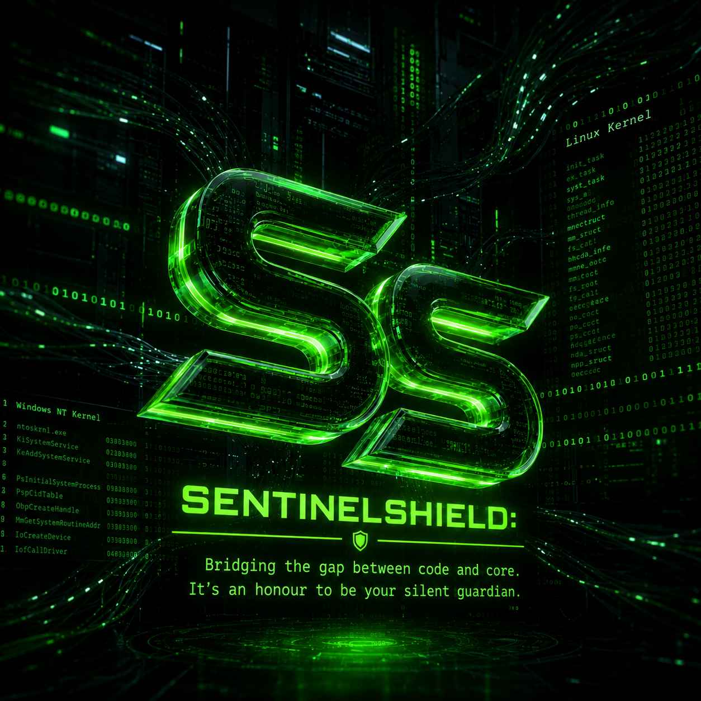

#  SentinelShield v3.0
> **"Bridging the gap between code and core. It’s an honour to be your silent guardian."**

[](https://opensource.org/licenses/MIT)
[](https://nextjs.org/)
[](https://tailwindcss.com/)
[](https://github.com/)

---

## 🌌 Overview
**SentinelShield** is a cutting-edge cybersecurity ecosystem designed to protect digital identities and provide deep threat analysis. Built with insights from advanced Linux environments (Kali Linux) and virtualization, this dashboard serves as an intelligent defense mechanism for the modern web.

---

## 🚀 Key Modules & Intelligence

### 🆔 Identity Enrollment Portal
A sophisticated module designed to verify and secure the user's digital footprint.
*   **Social Auth Integration:** Secure connection protocols for Facebook, Instagram, and GitHub.
*   **Unique Handle Assignment:** Personalized identifier allocation for system administrators.
*   **Encrypted Profiling:** Ensures user metadata is protected through high-level encryption logic.

### 📱 Spam Guardian (Caller ID)
A powerful tool for communication security and contact verification.
*   **Global DB Lookup:** Cross-referencing against a database of over 5 million spam signatures.
*   **Risk Scoring:** Real-time percentage-based risk calculation for every scanned number.
*   **Caller Identification:** Intelligent engine to uncover the likely owners of unknown identifiers.

### ☣️ Threat Analyst & Malware Shield
This high-tech module ensures the integrity of files, links, and local hardware.
*   **Heuristic File Scan:** Detecting hidden payloads in PDFs, EXEs, ZIPs, or images.
*   **Link Shield:** Analyzing URL redirects and blocking potential phishing attempts.
*   **Spyware Auditor:** Auditing camera permissions, microphone access, and background trackers in real-time.

### 🗺️ Network Intelligence
*   **Live Attack Map:** Visual representation of global threat vectors and active cyberattacks.
*   **Breach Monitor:** Checking if user credentials have been leaked in historical data breaches.
*   **Password Vault:** Highly secure management system utilizing AES encryption standards.

---

## 🛠️ Architecture & Tech Stack

| Component | Technology |
| :--- | :--- |
| **Frontend Framework** | Next.js 14 (App Router) |
| **Design System** | Tailwind CSS (Glassmorphism UI) |
| **Icons & Assets** | Lucide React |
| **Logic Layers** | Java, Python, and C++ inspired algorithms |
| **Environment** | Optimized for Linux/VirtualBox deployment |

---

## 📸 Dashboard Preview
*(Replace the link below with your actual project screenshot)*
``

---

## ⌨️ Installation Guide

Follow these steps to run the project on your local machine:

1. **Clone the Repo:**
   ```bash
   git clone [https://github.com/your-username/SentinelShield.git](https://github.com/your-username/SentinelShield.git)